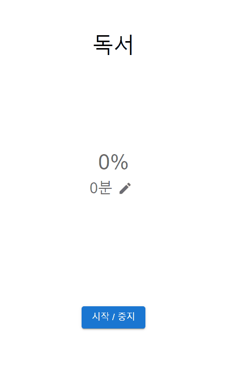

# Levelup Everyday

This is a habit tracker app which increases a daily goal by a tiny step to your final goal (so 'Level up'). 

This way, you will get used to the habit and finally achieve your great goal.



## Description

### Features

- 
- 

### Built with

- Django
- React

## Getting started

### Install

Database creation

```bash
mysql -u YOUR_USER_NAME -p
CREATE DATABASE levelup_everday_db;
USE levelup_everyday_db;
```

Environment variables

In 'backend' folder, make 'env_vars.py'. 

```python
# levelup_everyday/backend/env_vars.py

SECRET_KEY = 'Your Django Secret Key'

DATABASES = {
    'default': {
        'ENGINE': 'django.db.backends.mysql',
        'NAME': 'levelup_everyday_db',
        'USER': 'YOUR_MYSQL_USERNAME',
        'PASSWORD': 'YOUR_MYSQL_PASSWORD',
        'HOST': 'localhost',
        'PORT': '3306'
    }
}
```

1. Replace SECRET_KEY with new one from [Django Secret Key Generator](https://djecrety.ir/). 
   
   (ex. SECRET_KEY = '4p_!l6&db4(fmo#s#lo@m6d1v!+$s+pxc70m9n1f@*28x6v9oj')

2. Replace USER & PASSWORD in DATABASES with your MySQL's.
   
   (ex. 
   'USER': 'root',
   'PASSWORD': '123456789'
   )

Django

```bash
cd backend

# Install virtual environment
pip install virtualenv
virtualenv venv

# Install python packages
source venv/Scripts/activate
pip install -r requirements.txt

# Make migrations
python manage.py makemigrations
python manage.py migrate

# Run server
python manage.py runserver
```

React

```bash
cd frontend
npm install
npm run start
```

Mock API (using [JSON Server](https://github.com/typicode/json-server)))

```bash
npm install -g json-server
json-server --watch backend/sample.json
```

### Configure

Manual, context-specific tasks not covered in the installation process.

### Usage

[API](./README_API.md)

### Troubleshooting

Or FAQs, if that's more appropriate.

## Back matter

### Acknowledgements

- [TINY README Template · GitHub](https://gist.github.com/noperator/4eba8fae61a23dc6cb1fa8fbb9122d45)

### To-do

- [ ] Still need to do this
- [ ] ~~Decided not to do this~~
- [x] Done!

### License

This project is licensed under the [MIT License](LICENSE.md).